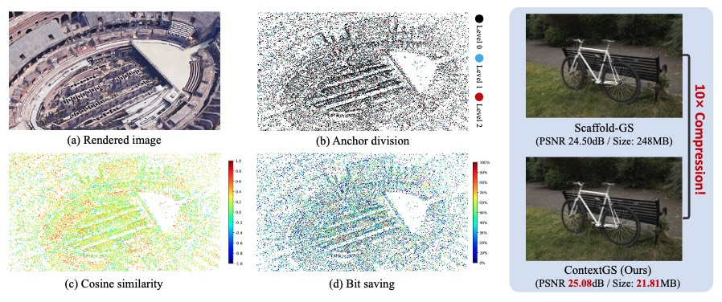
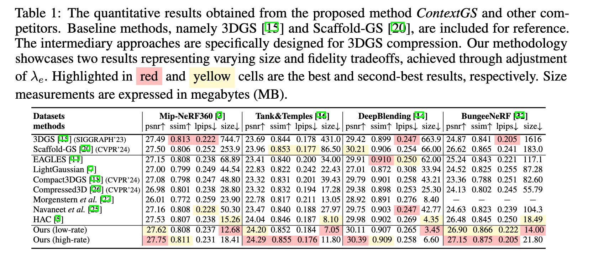

# _ContextGS_: Compact 3D Gaussian Splatting with Anchor Level Context Model

Welcome! The official implementation of the paper "[ContextGS: Compact 3D Gaussian Splatting with Anchor Level Context Model](https://arxiv.org/pdf/2405.20721)" will be released here soon!

[Yufei Wang](https://wyf0912.github.io/), [Zhihao Li](https://scholar.google.com/citations?user=gWlYsj0AAAAJ&hl=en), [Lanqing Guo](https://guolanqing.github.io/), [Wenhan Yang](https://flyywh.github.io/), [Alex C. Kot](https://personal.ntu.edu.sg/eackot/), [Bihan Wen](https://personal.ntu.edu.sg/bihan.wen/)

## :star: Overall

Our method, _ContextGS_, first proposes to reduce the spatial redundancy among anchors using an _autoregressive model_. 

We divide anchors into levels as shown in Fig.(b) and the anchors from coarser levels are used to predict anchors in finer levels, i.e., red anchors predict blue anchors then red and blue anchors together predict black anchors. Fig.(c) verifies the spatial redundancy by calculating the cosine similarity between anchors in level $0$ and their context anchors in levels $1$ and $2$. Fig.(d) displays the bit savings using the proposed anchor-level context model evaluated on our entropy coding based strong baseline built on [Scaffold-GS](https://github.com/city-super/Scaffold-GS). 

## :rocket: Performance
Compared with Scaffold-GS, we achieve better rendering qualities, faster rendering speed, and great size reduction of up to $15$ times averaged over all datasets we used.



## :fire: Train/Evaluation

### Installation

1. Unzip files
```
cd submodules
unzip diff-gaussian-rasterization.zip
unzip simple-knn.zip
cd ..
```
2. Install environment
```
conda env create --file environment.yml
# or `sh setup_env.sh` # tested on CUDA 11.8
conda activate contextgs
```

### Data

First, create a ```data/``` folder inside the project path by 
```
mkdir data
```

The data structure will be organised as follows:

```
data/
├── dataset_name
│   ├── scene1/
│   │   ├── images
│   │   │   ├── IMG_0.jpg
│   │   │   ├── IMG_1.jpg
│   │   │   ├── ...
│   │   ├── sparse/
│   │       └──0/
│   ├── scene2/
│   │   ├── images
│   │   │   ├── IMG_0.jpg
│   │   │   ├── IMG_1.jpg
│   │   │   ├── ...
│   │   ├── sparse/
│   │       └──0/
...
```

 - For instance: `./data/blending/drjohnson/`
 - For instance: `./data/bungeenerf/amsterdam/`
 - For instance: `./data/mipnerf360/bicycle/`
 - For instance: `./data/nerf_synthetic/chair/`
 - For instance: `./data/tandt/train/`


### Public Data (We follow suggestions from [Scaffold-GS](https://github.com/city-super/Scaffold-GS))

 - The **BungeeNeRF** dataset is available in [Google Drive](https://drive.google.com/file/d/1nBLcf9Jrr6sdxKa1Hbd47IArQQ_X8lww/view?usp=sharing)/[百度网盘[提取码:4whv]](https://pan.baidu.com/s/1AUYUJojhhICSKO2JrmOnCA). 
 - The **MipNeRF360** scenes are provided by the paper author [here](https://jonbarron.info/mipnerf360/). And we test on its entire 9 scenes ```bicycle, bonsai, counter, garden, kitchen, room, stump, flowers, treehill```. 
 - The SfM datasets for **Tanks&Temples** and **Deep Blending** are hosted by 3D-Gaussian-Splatting [here](https://repo-sam.inria.fr/fungraph/3d-gaussian-splatting/datasets/input/tandt_db.zip). Download and uncompress them into the ```data/``` folder.

### Custom Data

For custom data, you should process the image sequences with [Colmap](https://colmap.github.io/) to obtain the SfM points and camera poses. Then, place the results into ```data/``` folder.

### Training

To train scenes, we provide the following training scripts in `./scripts`: 
 - Tanks&Temples: ```run_shell_tnt.py```
 - MipNeRF360: ```run_shell_mip360.py```
 - BungeeNeRF: ```run_shell_bungee.py```
 - Deep Blending: ```run_shell_db.py```

 run them with 
 ```
 python run_shell_xxx.py
 ```

The code will automatically run the entire process of: **training, encoding, decoding, testing**.
 - Training log will be recorded in `output.log` of the output directory. Results of **detailed fidelity, detailed size, detailed time** will all be recorded
 - Encoded bitstreams will be stored in `./bitstreams` of the output directory.
 - Evaluated output images will be saved in `./test/ours_30000/renders` of the output directory.
 - Optionally, you can change `lmbda` in these `run_shell_xxx.py` scripts to try variable bitrate.
 - **After training, the original model `point_cloud.ply` is losslessly compressed as `./bitstreams`. You should refer to `./bitstreams` to get the final model size, but not `point_cloud.ply`. You can even delete `point_cloud.ply` if you like :).**

### Decompress from binary files
You can use the following command to decompress from the binary files:
```bash
python3 decompress.py 
  -s 'scene path to calucalte the metrics'
  --eval
  --lod '[int] level of detail'
  -m 'output path'
  --voxel_size '[float] voxel size used to train the model'
```

## :star: Citation
Please cite our paper if you find our work useful. Thanks! 
```
@inproceedings{
wang2024contextgs,
title={Context{GS} : Compact 3D Gaussian Splatting with Anchor Level Context Model},
author={Yufei Wang and Zhihao Li and Lanqing Guo and Wenhan Yang and Alex Kot and Bihan Wen},
booktitle={The Thirty-eighth Annual Conference on Neural Information Processing Systems},
year={2024},
url={https://openreview.net/forum?id=W2qGSMl2Uu}
}

```

## :email: Contact
If you have any questions, please feel free to contact me via `yufei001@ntu.edu.sg`.


## Acknowledgement

 - We thank all authors from [HAC](https://github.com/https://github.com/YihangChen-ee/HAC), [Scaffold-GS](https://github.com/city-super/Scaffold-GS), [3D-GS](https://github.com/graphdeco-inria/gaussian-splatting) for excellent works.
