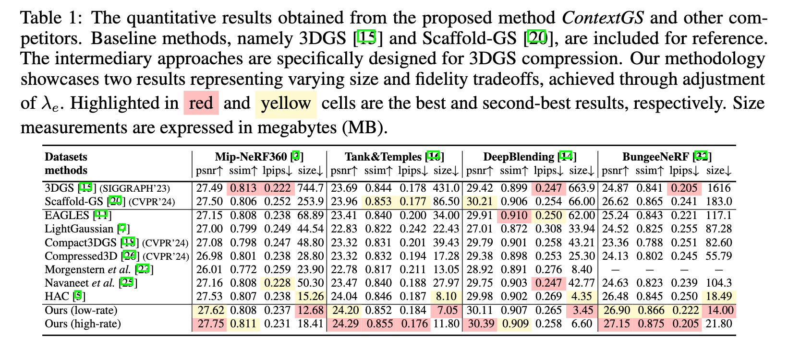

# _ContextGS_: Compact 3D Gaussian Splatting with Anchor Level Context Model

Welcome! The official implementation of the paper "[ContextGS: Compact 3D Gaussian Splatting with Anchor Level Context Model](./assets/ContextGS.pdf)" will be released here soon!

[Yufei Wang](https://wyf0912.github.io/), [Zhihao Li](https://scholar.google.com/citations?user=gWlYsj0AAAAJ&hl=en), [Lanqing Guo](https://guolanqing.github.io/), [Wenhan Yang](https://flyywh.github.io/), [Alex C. Kot](https://personal.ntu.edu.sg/eackot/), [Bihan Wen](https://personal.ntu.edu.sg/bihan.wen/)

## :star: Overall

Our method, _ContextGS_, first proposes to reduce the spatial redundancy among anchors using an _autoregressive model_. 

We divide anchors into levels as shown in Fig.(b) and the anchors from coarser levels are used to predict anchors in finer levels, i.e., red anchors predict blue anchors then red and blue anchors together predict black anchors. Fig.(c) verifies the spatial redundancy by calculating the cosine similarity between anchors in level $0$ and their context anchors in levels $1$ and $2$. Fig.(d) displays the bit savings using the proposed anchor-level context model evaluated on our entropy coding based strong baseline built on [Scaffold-GS](https://github.com/city-super/Scaffold-GS). 

## :rocket: Performance
Compared with Scaffold-GS, we achieve better rendering qualities, faster rendering speed, and great size reduction of up to $15$ times averaged over all datasets we used.



## :fire: Train/Evaluation

The code will be released soon.

## :star: Citation
Please cite our paper if you find our work useful. Thanks! 
```

```

## :email: Contact
If you have any questions, please feel free to contact me via `yufei001@ntu.edu.sg`.
